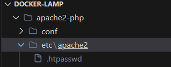
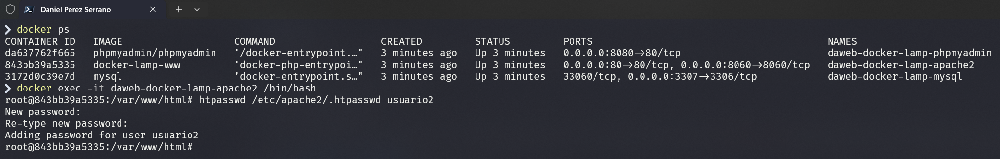

# Manual Despleigue Docker-lamp

## Índice de anotaciones.

> [!NOTE]
> Para el manual de despliegue.

> [!TIP]
> Para consejos claves.

> [!IMPORTANT]
> Para avisos importantes.

>[!WARNING]
> Para prestar atención en ese paso concreto.

> [!CAUTION]
> Para tener precaución en un punto concreto.

## Proyecto para la instalación de LAMP a través de contenedores Docker
### Estrucuctura del poroyecto:

```
docker-lamp
├─ .gitignore 
├─ LICENSE
├─ README.md
├─ apache2-php
│  ├─ Dockerfile
│  ├─ conf
│  │  ├─ 000-default.conf
│  │  └─ intranet.conf
│  ├─ etc
│  │  ├─ apache2
│  └─ www
│     ├─ index.html
│     ├─ intranet
│     │  └─ index.html
│     ├─ phpinfo.php
│     └─ test-bd.php
├─ dist
│  ├─ env.dist
│  └─ htpasswd.dist
├─ docker-compose.yml
├─ docs
│  └─ images
└─ mysql
   ├─ conf
   └─ dump
      └─ myDb.sql

```

## Descripcion de la estructura del proyecto: 
La estructura del proyecto `docker-lamp` es un entorno de desarrollo LAMP (Linux, Apache, MySQL, PHP) utilizando Docker. A continuación, se describen cada parte de la estructura:

- **.gitignore**: Este archivo indica a Git qué archivos o carpetas ignorar en el control de versiones, como archivos de configuración personales o directorios de compilación. En este caso ignoraremos el archivo con las variables de entorno .env

- **LICENSE**: Contiene información sobre la licencia bajo la cual se distribuye el proyecto, especificando cómo se puede usar o modificar.

- **README.md**: Incluye información sobre el proyecto, como descripciones, instrucciones de instalación, uso y créditos.

- **apache2-php/**: Esta carpeta contiene los archivos relacionados con el servidor web Apache y PHP.
  - **Dockerfile**: Script de instrucciones para construir la imagen Docker para el servidor Apache con PHP.
  - **conf/**: Contiene archivos de configuración para Apache.
    - **000-default.conf**: La configuración predeterminada del Virtual Host para Apache.
    - **intranet.conf**: La configuración del Virtual Host para la intranet, accesible en un puerto específico o subdominio.
  - **etc/apache2/**: Contiene archivos de configuración adicionales para el directorio apache2.
  - **www/**: Directorio que almacena los archivos del sitio web.
    - **index.html**: Página de inicio para el sitio principal.
    - **intranet/**: Carpeta que contiene los archivos para la sección de intranet del sitio.
      - **index.html**: Página de inicio para la intranet.
    - **phpinfo.php**: Script PHP para mostrar información sobre la configuración de PHP.
    - **test-bd.php**: Script PHP para probar la conexión a la base de datos MySQL.

- **dist/**: Contiene plantillas o archivos distribuibles, en este caso una versión de ejemplo del archivo `.env`.
  - **env.dist**: Una plantilla para el archivo de variables de entorno.
  - **htpasswd.dist**: Una plantilla para con usuario de ejemplo inicial para acceder a la intranet

- **docker-compose.yml**: Archivo YAML que define los servicios, redes y volúmenes para el proyecto, organizando y ejecutando múltiples contenedores Docker.

- **docs/**: Directorio destinado a contener documentación del proyecto.
  - **images/**: Imágenes utilizadas en la documentación.

- **mysql/**: Contiene configuraciones y datos relacionados con el servicio de base de datos MySQL.
  - **conf/**: Directorio para archivos de configuración personalizados de MySQL.
  - **dump/**: Contiene archivos de carga de bases de datos, como scripts SQL para inicializar la base de datos.
    - **myDb.sql**: Un script SQL con lo necesario para inicializar la base de datos.

 # Guía de Instalación del Proyecto Docker LAMP

Esta guía detalla los pasos para clonar y configurar un entorno Docker LAMP (Linux, Apache, MySQL, PHP) con Virtual Hosts.

## Clonar el Repositorio
> [!TIP]
>Primero, clonar el repositorio Git:

  ```bash
  git clone [https://github.com/antonio-gabriel-gonzalez-casado/docker-lamp/]
  cd docker-lamp
 ```


 

##  Copiar y configurar Archivo .env
>[!TIP]
>Copiar el archivo env.dist a .env y personaliza las variables de entorno:

  ```bash
  cp dist/env.dist .env
  ```

**Comprobamos**


> [!CAUTION]
> Editar el archivo .env estableciendo los siguientes valores:

  ```bash
   MYSQL_DATABASE=dbname
   MYSQL_USER=root
   MYSQL_PASSWORD=test
   MYSQL_ROOT_PASSWORD=test
   MYSQL_PORT=3307
 ```

##  Copiar y configurar Archivo .htpasswd

Copiar el archivo **htpasswd.dist** a `./apache2-php/etc/apache2/` y añade usuarios para acceder a la intranet:
>[!CAUTION]
>   ```bash
>   cp dist/htpasswd.dist ./apache2-php/etc/apache2/.htpasswd
>   ```


> **Comprobamos que se ha copiado adecuadamente:**



> [!TIP]
>Añadir un usuario con formato: `USUARIO:CONTRASEÑA`
>La constraseña se puede generar con la utilidad de apache2-utils o directamente usando un
>[generador online](https://hellotools.org/es/generar-cifrar-contrasena-para-archivo-htpasswd)


Una vez generada copiamos el usuario:contrasña en el adchivo `.htpasswd`:


>[!WARNING]
> Modificar el archivo _**Dockerfile**_ para que copie los `USUARIO:CONTRASEÑA` en el directorio del contenedor `/etc/apache2/`
>
> Asegurate de tner la siguiente línea en el _**Dockerfile**: 

  ```bash
COPY ./etc/apache2/.htpasswd /etc/apache2/.htpasswd

 ```

## Construir las Imágenes
>[!TIP]
>Construir las imágenes usando Docker Compose:
   ```bash
   docker-compose build
  ```


### Prueba de los servicios:
>[!IMPORTANT]
>Para probar si los servicios están funcionando correctamente, acceder a los siguientes enlaces a >través del navegador:


>- **Prueba del sitio principal**: [http://localhost](http://localhost)


>- **Prueba de la intranet**: [http://localhost:8060 (usando usuario1 y contraseña:123456789 o >  >el usuario creado en el paso anterior)](http://localhost:8060)

>[!WARNING]
> Al ingresar en el enlace de la intranet te pedirá el usuario y la contraseña


>- **Prueba de PHP Info**: [http://localhost/phpinfo.php](http://localhost/phpinfo.php)


>- **Prueba de Conexión a la Base de Datos**: [http://localhost/test-bd.php](http://localhost/test-bd.php)


>- **Prueba de phpmyadmin**: [http://localhost:8080 (con el usuario root y la contraseña >establecida)](http://localhost:8080)


## Iniciar los Contenedores
[!TIP]
Arrancar los contenedores en modo detached `-d`:
  ```bash
 docker-compose up -d
  ```
 


## Parte 1 (VIRTUAL HOST)


### A) Modificar el nombre del virtualhost de la intranet y de local con nombre-apellido-x.local
> [!NOTE]
>> En la carpeta `./docker-lamp/apache2-php/conf`
>> > En el archivo `000-dafault.conf`:
> 
>
>
>> > En el archivo `intranet.conf`:
>
> 
>

### B) Crear un nuevo virtual host para el servicio phpmyadmin. Este deberá estar configurado con el nombre nombre-apellidos-phpmyadmin.local:8081 y debe ser solo accesible por los mismos usuarios que pueden acceder a la intranet.
> [!NOTE]
>> En la carpeta `./docker-lamp/apache2-php/conf`
>> > Creamos el archivo en cuestion con el nombre: `nombre-apellidos-phpmyadmin.conf`
>> > Instrucciones de configuración:
>> >- Configurar el puerto la escucha por el puerto 8081
>> >- Tener la misma configuración de autenticación que la intranet, pero en este caso en vez de estar dentro de <Directory> debe estar dentro de la etiqueta <location /> ya que se va a configurar un proxy inverso para redirigir.
>> >- Después de cerrar la etiqueta </Location> se tiene que incluir la configuración del proxy inverso que redirija todas las peticiones al servicio de phpmyadmin desplegado. Hay que agregar las siguientes líneas:

```bash
ProxyPreserveHost On
ProxyPass / http://phpmyadmin:80/
ProxyPassReverse / http://phpmyadmin:80/
```


 ### Habilitar los módulos de proxy inverso en el Dockerfile de la imágen de apache, estos módulos son: proxy proxy_http. Y activar el módulo de configuración del nombre-apellidos-phpmyadmin.conf en el Dockerfile del fichero apache.

> [!IMPORTANT]
>Para ello en el _**Dockerfile**_ añadimos las siguientes líneas:
>

 >  ```bash
 > && a2enmod proxy \
  > && a2enmod proxy_http \
>
 >   # Activar el módulo de configuración del nombre-apellidos-phpmyadmin.conf
>   RUN a2ensite daniel-perezserrano-phpmyadmin.conf
>   ```
 >  
>

### C) Modifica el index.html de la intranet para que tenga otra apariencia distinta a la página por defecto, puede ser cualquier plantilla html "copyleft o free" que encuentres por internet.
> [!NOTE]
> Añadir a la carpeta  `apache2-php\www\intranet ` los archivos de la web que queramos alojar:


>[!IMPORTANT]
> Modifica el __**Dockerfile**_ para que copie los archivos al directorio `/var/www/html/intranet` del contenedor

```bash
# Copiar el nuevo index.html para la intranet
COPY ./www/intranet/index.html /var/www/html/intranet/index.html
COPY ./www/intranet/assets /var/www/html/intranet/assets
COPY ./www/intranet/images /var/www/html/intranet/images
```

Comprueba que todo ha funcionado correctamente ingresando en la intranet:


### D) Añade un nuevo usuario con el formato nombre-apellidos a la lista de usuarios que puede acceder a la intranet.

> [!TIP]
> Para acceder a al intranet se necesita crear un archivo .htpasswd con los nombres de usuario y sus contraseñas. Se puede usar la herramienta htpasswd para esto. Para ello accede al contenedor daweb-docker-lamp-apache2 a través del terminal mediante el siguiente comando:

 ```bash
 docker exec -it daweb-docker-lamp-apache2
 ```
>> **O bien a traves de la interfaz de docker:**


> Lanzar el comando que crea un usuario llamado usuario2 y pedirá que se introduzca una contraseña:

 ```bash
 htpasswd /etc/apache2/.htpasswd usuario2
 ```


### E) En el sitio principal realiza la instalación de un CMS Wordpress.

  Pasos: 
  >#### 1. Descargar y extraer el directorio wordpress en la siguiente dirección: `apache2-php\www\intranet `
    >  > [!Enlace de descarga](https://wordpress.org/download/)

    

  >> >Editamos el directorio al _**Dockerfile**_ para que lo copie en el contendor `apache2-php`:

   ```bash
  COPY ./www/intranet/wordpress /var/www/html/
   ```
   **O bien descargamos directamente y extraemos wordpress desde la bash del contenedor:**
   > Con el siguiente comando:
   ```bash
    curl -O https://wordpress.org/latest.tar.gz
   ```

   


  >#### 2. Creamos una base de datos para el wordpress: 

  > [!IMPORTANT]
  > Este paso es esencial, sino se realiza no podremos comenzar con la instalación del CMS.


  
  >#### 3. Comenzamos la instalación: 

  > [!TIP]
  >En el directorio de **wordpress** esta el archivo **`readme.html`**, en el cual se detallan los pasos de la instalación.


  >> En el navegador en nuestro local (www.local) abrimos el siguiente archivo que está en el directorio de wordpress: `wp-admin/install.php`
  ```bash
   # Quedaria así la url: 
   www.local/wp-admin/install.php
   ```
 >> Y esto es lo que nos mostraría:


  >#### 4. Seguimos los pasos del instalador, rellenamos los datos e instalamos: 

  >> - Primero deberemos conectarnos a la base de datos previamente creada
  >> - Segundo, una vez nos conectemos nos creará el contenido que debe ir en el fichero de configuración **`wp-config.php`**.
  >>>Creamos el fichero en directorio de **wordpress** y copiamos el contenido. 
  >>> Una vez hecho esto y guardado el fichero volvemos al navegador y le damos a **Run the instalation.**

  

  >> - Tercero rellenamos los datos de la web y personales y le damos a Install **Worspress**


  >#### 5. Comprobar que se ha instalado adecuadamente:
  
   Automaticamente nos redirije a  **`wp-login.php`**, introducimos el nombre de usuario y la contraseña. Y se nos abrirá la siguiente ventana: 

  


## Parte 2 (CERTIFICADOS SSL)

### Instalación de Certificados SSL
>[!WARNING]
>>Hay que modificar el fichero `/etc/hosts` del sistema operativo anfitrión (no el contenedor de >>docker) y añadir las siguientes líneas:

```bash
127.0.0.1	www.local
127.0.0.1	intranet.local
```

#### Generación de Certificados
Crear un directorio llamado certs en el directorio raiz del proyecto para almacenar los certificados. 

> - Directorio raiz `./docker-lamp/`

```bash
mkdir certs
cd certs
```


Lanzar el comando de generación de certificados de openssl:
>[!WARNING]
>**ANTES DE LANZAR EL COMANDO**
>Asegurate de tener el fichero de  `openssl.conf` en la dirección: `C:\Apache24\conf`
>
```bash
openssl req -x509 -nodes -days 365 -newkey rsa:2048 -keyout www.key -out www.crt

openssl req -x509 -nodes -days 365 -newkey rsa:2048 -keyout intranet.key -out intranet.crt

```
> [!NOTE]
> 
>Este comando crea un certificado (crt) y una clave privada (key) válidos por 365 días.
> - x509: Especifica que quieres generar un certificado autofirmado.
> - nodes: Crea una clave sin contraseña.
> - days 365: El certificado será válido por 365 días.
> - newkey rsa:2048: Crea una nueva clave de 2048 bits.
> - keyout: El nombre del archivo para la clave privada (normalmente será el nombre del dominio)
> - out: El nombre del archivo para el certificado (normalmente será el nombre del dominio)

> [!IMPORTANT]
>Durante el proceso, se piden detalles como país, estado, organización, etc. 
> 
>Para Common Name (Introducir el nombre del dominio www.local, intranet.local).
>

Una vez creados copialos al contenedor de apache2-php, editando el _**Dockerfile**_ con el siguiente comando: 

```bash
# Copiar archivos de contraseñas
COPY ./certs /etc/apache2/ssl
```

#### Configurar Virtual Host 443
> [!CAUTION]
>En cada archivo de configuración agregar una regla como esta replicando la configuración adicional de la ya existente:

>> Editar el archivo `000-default.conf` estableciendo los siguientes valores:

  ```bash
  <VirtualHost *:443>
   ServerName www.local
    SSLEngine on
    SSLCertificateFile /etc/apache2/ssl/www.local.crt
    SSLCertificateKeyFile /etc/apache2/ssl/www.local.key
    </VirtualHost>
 ```

>> Editar el archivo `intranet.conf` estableciendo los siguientes valores:

  ```bash
   <VirtualHost *:443>
   ServerName intranet.local
    SSLEngine on
    SSLCertificateFile /etc/apache2/ssl/intranet.local.crt
   SSLCertificateKeyFile /etc/apache2/ssl/intranet.local.key
    </VirtualHost>
 ```

#### Habilitar el módulo mod_ssl

Edita el el _**Dockerfile**_ con el siguiente comando: 

```bash
RUN a2enmod ssl
```
#### Comprobamos en el navegador

- **Sitio Principal**: [https://www.local](https://www.local)


- **Intranet**: [https://intranet.local](https://intranet.local)


